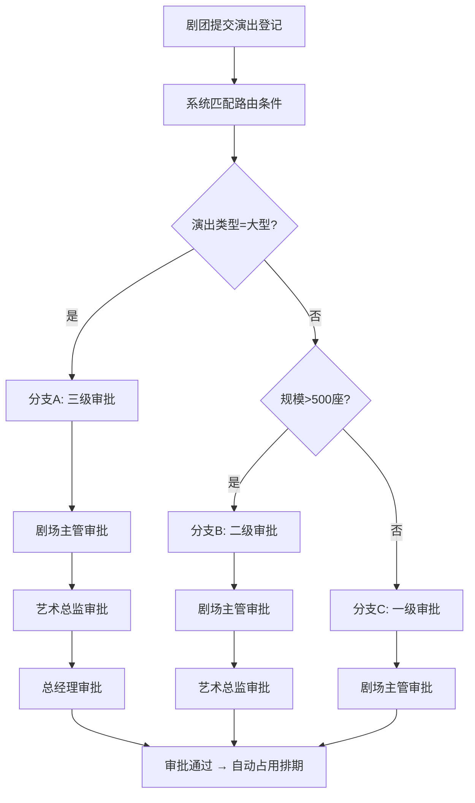

## 1. 产品概述
剧场舞台租用管理移动App，面向剧场运营方和合作剧团，解决舞台排期混乱、审批流程僵化、周期性排练占用管理低效等痛点。
- 目标用户：剧场管理员、剧团负责人、审批人员
- 核心价值：自动化周期排期生成、灵活可配置的分支审批流程、一目了然的舞台资源管理

## 2. 核心功能

### 2.1 用户角色
| 角色 | 注册方式 | 核心权限 |
|------|----------|----------|
| 剧场管理员 | 系统分配 | 舞台资源建档、审批配置、全量排期管理 |
| 剧团负责人 | 邀请注册 | 提交演出登记、查看本剧团排期、申请排练时段 |
| 审批人员 | 系统分配 | 按分支条件接收审批任务、审批/驳回演出申请 |

### 2.2 功能模块
1. **舞台排期**：舞台日历视图、冲突检测、资源占用总览
2. **周期生成**：周期规则设定、批量生成未来占用、单次例外调整
3. **分支审批**：条件路由配置、分支动态选择、审批进度追踪
4. **演出登记**：演出信息录入、灯光音响清单、提交审批

### 2.3 页面明细
| 页面名称 | 模块名称 | 功能描述 |
|----------|----------|----------|
| 首页仪表盘 | 全局 | 今日排期概览、待审批提醒、资源利用率图表、快捷入口 |
| 舞台列表 | 舞台排期 | 舞台资源建档（名称/类型/座位数/灯光音响设备清单）、编辑/禁用舞台 |
| 排期日历 | 舞台排期 | 月/周视图切换，按舞台筛选，显示占用状态色块，点击查看占用详情 |
| 占用详情 | 舞台排期 | 查看单次占用的剧团、时段、用途、关联演出，支持手动调整 |
| 周期规则列表 | 周期生成 | 按剧团分组显示所有周期规则，启用/停用/编辑/删除 |
| 新建周期规则 | 周期生成 | 选择剧团、舞台、星期几、起止时间、生效起止日期、规则名称 |
| 批量生成预览 | 周期生成 | 预览未来N周即将生成的占用记录，检测冲突，确认后批量创建 |
| 例外调整 | 周期生成 | 对已生成的某次周期占用进行取消、改时间、改舞台等单独调整 |
| 审批路由配置 | 分支审批 | 配置路由条件（演出类型/规模/天数等）→ 审批分支映射，可视化条件树 |
| 审批分支管理 | 分支审批 | 创建/编辑审批分支（分支名、审批节点、审批人角色），拖拽排序节点 |
| 我的审批 | 分支审批 | 待我审批列表、已审批历史、审批/驳回操作、填写意见 |
| 演出登记列表 | 演出登记 | 所有演出登记记录，按状态筛选（草稿/审批中/已通过/已驳回） |
| 新建演出登记 | 演出登记 | 填写演出名称/类型/日期/规模/剧团/灯光需求清单/音响需求清单，自动匹配审批分支 |
| 灯光音响清单 | 演出登记 | 按舞台关联设备库选择所需设备，自定义数量和备注，生成设备需求清单 |

## 3. 核心流程

### 3.1 周期排期生成流程
剧团管理员设定周期规则 → 系统按规则预生成未来占用 → 预览界面检测冲突 → 确认后批量写入排期 → 如需调整某次占用，进入例外调整 → 修改/取消该次占用而不影响其他周期记录

### 3.2 演出审批流程
剧团提交演出登记 → 系统根据路由条件（演出类型+规模）自动匹配审批分支 → 按分支定义的审批节点依次推送审批任务 → 审批人审批/驳回 → 全部通过则登记生效 → 排期自动占用对应舞台时段

### 3.3 例外调整流程
在排期日历中选择某次周期占用 → 进入例外调整 → 可取消该次占用/改时间/换舞台 → 系统标记该记录为"已例外调整"→ 原周期规则不受影响，继续生成后续占用

## 4. 用户界面设计

### 4.1 设计风格
- 主色调：深靛蓝 (#1B2A4A) + 琥珀金 (#D4A843)，营造剧场幕布与灯光氛围
- 辅助色：暖白 (#FAF7F0) 背景、深红 (#8B2E2E) 用于警示/驳回
- 按钮：圆角微凸3D质感按钮，金色系主操作按钮
- 字体：标题用"Playfair Display"衬线体（剧场典雅感），正文用"Noto Sans SC"中文无衬线
- 布局：移动端底部Tab导航，卡片式内容组织，日历采用横向周视图
- 图标：线性图标 + 微光渐变，风格统一
- 背景纹理：细微幕布褶皱纹理叠加，深色页面加微弱聚光灯光晕

### 4.2 页面设计概览
| 页面名称 | 模块名称 | UI要素 |
|----------|----------|--------|
| 首页仪表盘 | 全局 | 深色背景，顶部剧场名+日期，金色卡片式今日排期，环形图显示利用率，浮动聚光灯动画 |
| 舞台列表 | 舞台排期 | 卡片式舞台缩略图，底部标签显示类型/座位数，右上角设备数角标 |
| 排期日历 | 舞台排期 | 周视图横轴时间/纵轴舞台，色块区分剧团，底部Tab切换月/周视图，拖拽查看更多 |
| 周期规则列表 | 周期生成 | 按剧团分组的折叠面板，每条规则显示星期+时段+舞台，右侧启用开关 |
| 新建周期规则 | 周期生成 | 步骤式表单（1.剧团舞台 → 2.时段设置 → 3.生效期），底部进度条 |
| 批量生成预览 | 周期生成 | 时间轴式预览，冲突项红色高亮，底部"生成N条占用"金色按钮 |
| 审批路由配置 | 分支审批 | 可视化条件树，节点卡片可拖拽，连线显示条件，右侧属性面板编辑条件 |
| 审批分支管理 | 分支审批 | 纵向流程图，每节点为审批人角色卡片，可拖拽调整顺序 |
| 我的审批 | 分支审批 | 待审批金色边框卡片居顶，已审批灰色收起，滑动操作审批/驳回 |
| 新建演出登记 | 演出登记 | 分段式长表单，顶部进度指示，灯光音响清单为可展开选择器 |
| 灯光音响清单 | 演出登记 | 设备库网格卡片，选中项金色勾选标记，底部浮动汇总数量 |

### 4.3 响应式适配
- 移动端优先设计（375px基准宽度）
- 底部Tab导航适配拇指操作热区
- 日历视图支持横向滑动和捏合缩放
- 表单输入适配移动端键盘弹出
- 卡片式布局自适应列数，平板端双列展示

### 4.4 3D场景指引
- 不涉及3D场景
