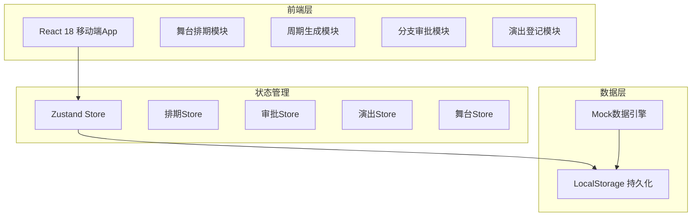
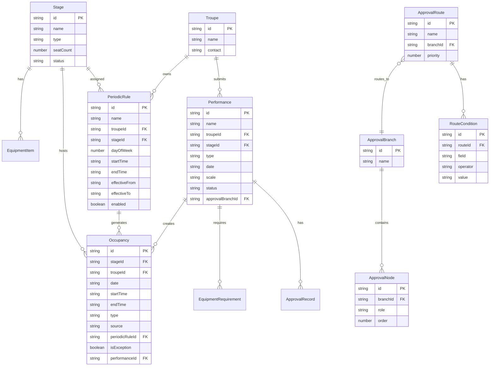

## 1. 架构设计



## 2. 技术说明
- 前端：React@18 + TailwindCSS@3 + Vite
- 初始化工具：Vite
- 状态管理：Zustand（轻量、无boilerplate）
- 后端：无（纯前端Mock数据）
- 数据库：LocalStorage + 内存数据，启动时加载Mock数据
- 路由：React Router v6
- 日历组件：自研周/月视图
- 动画：Framer Motion
- 图标：Lucide React
- 日期处理：date-fns

## 3. 路由定义
| 路由 | 用途 |
|------|------|
| / | 首页仪表盘 |
| /stages | 舞台列表 |
| /stages/:id | 舞台详情（含设备清单） |
| /schedule | 排期日历 |
| /schedule/occupancy/:id | 占用详情 |
| /periodic | 周期规则列表 |
| /periodic/new | 新建周期规则 |
| /periodic/preview | 批量生成预览 |
| /periodic/exception/:id | 例外调整 |
| /approval/routes | 审批路由配置 |
| /approval/branches | 审批分支管理 |
| /approval/my | 我的审批 |
| /performances | 演出登记列表 |
| /performances/new | 新建演出登记 |
| /performances/:id | 演出详情 |
| /equipment | 灯光音响设备清单 |

## 4. API定义（Mock层）

### 4.1 舞台相关
```typescript
interface Stage {
  id: string;
  name: string;
  type: "大剧场" | "小剧场" | "实验剧场" | "露天舞台";
  seatCount: number;
  status: "active" | "inactive";
  lightingEquipment: EquipmentItem[];
  soundEquipment: EquipmentItem[];
}

interface EquipmentItem {
  id: string;
  name: string;
  category: "灯光" | "音响";
  spec: string;
  quantity: number;
  stageId: string;
}
```

### 4.2 排期占用
```typescript
interface Occupancy {
  id: string;
  stageId: string;
  troupeId: string;
  date: string;
  startTime: string;
  endTime: string;
  type: "排练" | "演出" | "装台" | "拆台";
  source: "periodic" | "manual" | "performance";
  periodicRuleId?: string;
  isException: boolean;
  performanceId?: string;
  remark?: string;
}
```

### 4.3 周期规则
```typescript
interface PeriodicRule {
  id: string;
  name: string;
  troupeId: string;
  stageId: string;
  dayOfWeek: number;
  startTime: string;
  endTime: string;
  effectiveFrom: string;
  effectiveTo: string;
  enabled: boolean;
  occupancyType: "排练" | "装台";
}
```

### 4.4 审批路由与分支
```typescript
interface ApprovalRoute {
  id: string;
  name: string;
  conditions: RouteCondition[];
  branchId: string;
  priority: number;
}

interface RouteCondition {
  field: "performanceType" | "scale" | "duration" | "seatRange";
  operator: "eq" | "neq" | "gt" | "lt" | "in" | "between";
  value: string | number | string[];
}

interface ApprovalBranch {
  id: string;
  name: string;
  nodes: ApprovalNode[];
}

interface ApprovalNode {
  id: string;
  role: "剧场主管" | "艺术总监" | "总经理" | "技术主管";
  order: number;
  branchId: string;
}
```

### 4.5 演出登记
```typescript
interface Performance {
  id: string;
  name: string;
  troupeId: string;
  stageId: string;
  type: "话剧" | "音乐剧" | "舞蹈" | "音乐会" | "戏曲" | "其他";
  date: string;
  startTime: string;
  endTime: string;
  scale: "小型" | "中型" | "大型" | "特大型";
  expectedAudience: number;
  status: "draft" | "pending" | "approved" | "rejected";
  lightingRequirements: EquipmentRequirement[];
  soundRequirements: EquipmentRequirement[];
  approvalBranchId?: string;
  currentApprovalNode?: number;
  approvalRecords: ApprovalRecord[];
}

interface EquipmentRequirement {
  equipmentId: string;
  quantity: number;
  remark?: string;
}

interface ApprovalRecord {
  nodeId: string;
  approverRole: string;
  result: "approved" | "rejected";
  comment?: string;
  timestamp: string;
}
```

## 5. 服务器架构图
纯前端项目，无后端服务。数据通过Zustand + LocalStorage持久化。

## 6. 数据模型

### 6.1 数据模型定义



### 6.2 数据定义语言
使用TypeScript接口定义 + JSON Mock数据文件，数据启动时自动载入Zustand Store并持久化至LocalStorage。

Mock数据文件：
- `src/data/stages.json` - 舞台与设备数据
- `src/data/troupes.json` - 剧团数据
- `src/data/periodicRules.json` - 周期规则
- `src/data/occupancies.json` - 排期占用
- `src/data/performances.json` - 演出登记
- `src/data/approvalBranches.json` - 审批分支
- `src/data/approvalRoutes.json` - 审批路由
